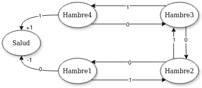
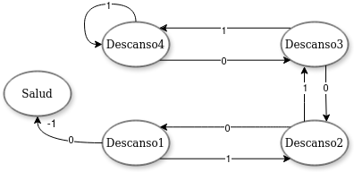
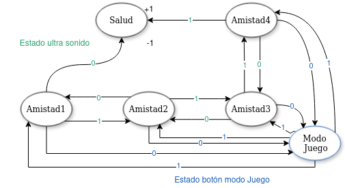
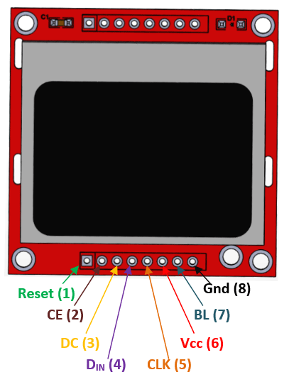
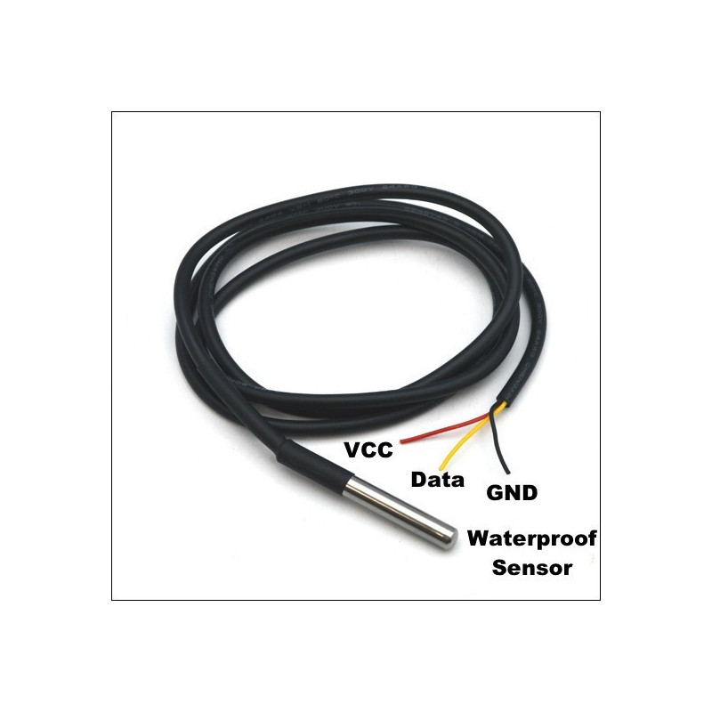

# Entrega 1 del proyecto WP01
## Introduccion

---

### Objetivo

---

## Descripcion General del Sistema

---

## Requisitos del Sistema
### Sistema de Botones
El tamagochi tendra cuatro botones o interruptores con las siguientes funcionalidades:

+ **Boton Alimentacion:** Este es un ***pulsador*** y servira para dar alimento a la mascota virtual.
+ **Boton Juego:** Este es un ***interruptor***, permitira entrar al modo juego y tener otras interacciones con la mascota.
+ **Boton Reset:** Este es un ***pulsador***, restablece estadisticas y datos del juego.
+ **Boton Test:** Este es un ***pulsador***, servira para cambiar el modo de operacion de la mascota rapidamente.

### Sistema de Sensado
Se tiene pensado usar 3 sensores, estos serviran para dar estimulos a la mascota virtual y/o mejorar la interacion jugador-maquina. Estos sensores y sus interacciones son:

+ **Sensor Ultrasonido(hc-sr04):** Este sensor detecta proximidad de objetos por medio del eco producido por una onda enviada por el sensor al rebotar con un objeto. Se usara para el modo juego, donde por medio de diferentes interacciones se puedan detectar acciones como acariciar, acercarse y jugar con la mascota virtual. 

+ **Sensor de Temperatura(ds18b20):** Este sensor permite por medio de una señal de 8 bits conocer la temperatura, tiene un rango de operacion de -55 a 125 grados centigrados. Para este se definiran 2 limites de temperatura, si se pasa el limite inferior el tamagochi sufrira efectos de frio, de igual manera si sobrepasa el limite superior sufrira de calor.

+ **Sensor de Luz(Modulo GLS516):** Este modulo tiene una fotoresistencia y es capaz de entregar una salida digital de un bit para iluminacion, en este proyecto se usara como interruptor interviniendo en los ciclos de descanso de la mascota virtual.

### Sistema de Visualizacion
#### Nokia 5110
Esta pantalla tiene una resolucion de 84x48 pixeles, y se maneja mediante el protocolo de comunicacion SPI. En ella se visualizara la mascota virtual y los niveles de las diferentes estadisticas, para ello se dividira la pantalla en 2 viendose la mascota al lado izquierdo y los niveles en el lado derecho, ademas tambien se desea incluir la temperatura en la esquina superior derecha.

## Arquitectura del sistema 
### Diagrama de Bloques
### Máquina de Estados

#### Hambre

Entrada Botón de alimentación

#### Descanso

Entrada digital del Sensor de Luz(Modulo GLS516)

#### Juego

### Descripcion de Componenetes
+ **FPGA CYCLONE IV EP4CE10E22C8:** Producida por Intel y lanzada en el 2009, cuenta con 22000 elementos logicos y albegara toda la logica de comportamiento de la mascota virtual.

+ **Pantalla NOKIA 5110:** La pantalla LCD Nokia 5110 es un pequeño módulo gráfico de cristal líquido que se usaba en teléfonos móviles Nokia antiguos, como el modelo 5110. Es de un tamaño aproximado de 43 mm de ancho y 41 mm de alto y una resolucion de 84 x 48 píxeles. Solo permite ver en color negro y blanco, y utiliza el protocolo SPI (Interfaz Periférica Serial) para comunicarse con otros dispositivos, tambien cuenta con retroiluminacion led.

+ **Interruptores:** Se usara un interruptor, este envia una señal de 1 bit segun este activado o no, servira para entrar al modo juego.
+ **Pulsadores:** Se usaran 3 pulsadores, uno para dar alimento a la mascota con cada pulso como un nivel de alimentacion, otro para el reset que al oprimirlo se restablece las estadisticas y datos de juego y otro para el modo teste que al pulsarlo se entra en el modo test y luego permite cambiar los modos de operacion de la mascota virtual.
+ **Sensor Ultrasonido(hc-sr04):** El sensor emite ondas ultrasónicas a través de un transductor y mide el tiempo que tardan las ondas en rebotar de vuelta después de chocar contra un objeto. Con esta medida de tiempo y la velocidad del sonido, puede calcular la distancia entre el sensor y el objeto. El HC-SR04 tiene dos partes principales: el emisor, que envía las ondas ultrasónicas, y el receptor, que las recibe cuando se reflejan y tiene cuatro pines: Vcc (alimentación), Trig (activación), Echo (recibo), y GND (tierra). Puede medir distancias desde 2 cm hasta aproximadamente 400 cm (4 metros). La comunicacion con la FPGA es PWM.

+ **Sensor de Temperatura(ds18b20):** Es un sensor digital de temperatura que puede medir temperaturas desde -55 °C hasta 125 °C y tiene una precisión de ±0.5 °C en un rango de temperatura entre -10 °C y +85 °C, y una precisión ligeramente menor fuera de este rango. La resolución del sensor es programable, pudiendo ajustarse desde 9 bits hasta 12 bits, lo que equivale a una precisión de 0.5 °C a 0.0625 °C, respectivamente. Utiliza el protocolo 1-Wire para comunicarse con otros dispositivos. Generalmente, viene en un encapsulado TO-92, que es compacto y tiene tres pines: GND (tierra), DQ (datos), y VDD (alimentación). También se puede encontrar en encapsulados resistentes al agua, ideales para aplicaciones en exteriores o entornos húmedos.

+ **Sensor de Luz(Modulo GLS516):** Es un sensor fotoeléctrico que utiliza una célula fotosensible para detectar la intensidad de la luz. Convierte la luz ambiental en una señal eléctrica, permitiendo así medir la intensidad luminosa.

### Interfaces
+ **SPI(Serial Peripheral Interface):** es un protocolo de comunicación en serie comúnmente utilizado para conectar dispositivos electrónicos y periféricos a microcontroladores y microprocesadores. El SPI sigue un modelo maestro-esclavo, donde un dispositivo actúa como maestro y uno o más dispositivos como esclavos. El maestro controla la comunicación, mientras que los esclavos responden a las órdenes del maestro, este puede comunicarse con múltiples esclavos, seleccionando a cada uno mediante una señal de selección de esclavo (Slave Select, SS), también conocida como Chip Select (CS). Tiene las siguientes lineas de Comunicacion:
  
  + SCLK (Serial Clock): Es la línea de reloj. El maestro genera la señal de reloj, que sincroniza la transferencia de datos.
  + MOSI (Master Out, Slave In): Es la línea por donde el maestro envía datos al esclavo.
  + MISO (Master In, Slave Out): Es la línea por donde el esclavo devuelve datos al maestro.
  + SS (Slave Select): Es la línea utilizada para seleccionar al esclavo con el que el maestro desea comunicarse.

  *Se usara para la pantalla nokia 5110 LCD y tambien puede usarse para algunos sensores como giroscopios o acelerometros.*

+ **PWM (Pulse Width Modulation, o Modulación por Ancho de Pulso):** es una técnica utilizada en electrónica para controlar la cantidad de energía entregada a un dispositivo a través de señales digitales. Se usa para variar la potencia entregada a dispositivos como motores, luces, y otras cargas, sin tener que usar una señal analógica.

  *Se usara para el sensor de ultrasonido*

+ **1-WIRE:** es un protocolo de comunicación bidireccional que utiliza solo una línea para datos y alimentación, además de un segundo hilo para tierra. Esto permite reducir la cantidad de cables necesarios para conectar dispositivos. El protocolo está basado en un modelo maestro-esclavo, donde un dispositivo actúa como maestro y puede controlar varios esclavos. El maestro inicia la comunicación y controla el flujo de datos. Los esclavos responden a las instrucciones del maestro. Cada dispositivo 1-Wire tiene una dirección única de 64 bits, lo que permite identificarlo y distinguirlo de otros dispositivos en la misma línea. Esto es útil para aplicaciones con múltiples dispositivos en un solo bus. La comunicación se realiza a través de secuencias de bits, donde un pulso corto o largo define un bit de datos. Esto se logra mediante cambios en la tensión de la línea de datos.

## Especificaciones de Diseño Detalladas
### Modos de Operacion

Los modos de operación se trata de un conjunto de instrucciones que puede ejecutar una aplicación. El conjunto de instrucciones que se pueden ejecutar según el que modo escoja el usuario por, lo mismo es el modo o meoto de operacción utilizado ya que representa una diferencia entre cada uno de los metodos posibles.

+ **Modo Test:** permite a los usuarios y desarrolladores validar la funcionalidad del sistema y sus estados sin necesidad de seguir el flujo de operación normal. En este modo, se pueden forzar transiciones de estado específicas mediante interacciones simplificadas, como pulsaciones cortas de botones, para verificar las respuestas del sistema y la visualización. Este modo es esencial durante la fase de desarrollo para pruebas rápidas y efectivas de nuevas características o para diagnóstico de problemas.

  + **Activacion:** Se ingresa al modo Test manteniendo pulsado el botón "Test" por un periodo de 5 segundos.
  + **Funcionalidad:** Permite la navegación manual entre los estados del Tamagotchi, ignorando los temporizadores o eventos aleatorios, para observar directamente las respuestas y animaciones asociadas.

+ **Modo Normal:** El Modo Normal es el estado de operación estándar del Tamagotchi, donde la interacción y respuesta a las necesidades de la mascota virtual dependen enteramente de las acciones del usuario.

  + **Activacion:** La mascota virtual por defecto va a estar en este modo, o si esta en modo test para volver a este hay q mantener presionado el boton de test.

  + **Funcionalidad:** La mascota va a responder a multiples estimulos provenientes de los botones, y los sensores, estos estimulos ademas del paso del tiempo haran que cambie de estados siendo estos feliz, triste, hambriento, cansado, enfermo y un estado extremo que es muerto. 

### Estados y Transiciones:
#### Estados
La mascota virtual tiene diferentes estados dependiendo de sus estimulos o el tiempo puede estar en cada uno de ellos, para ellos primero se debe definir el tiempo de la mascota virtual que para eventos actuales se tomara como *X* como 1 dia de 24 horas, y los estados principales iran en una barra de niveles de 1 a 8.

##### Estados Principales:

+ **Hambre:** Se definira segun el tiempo o las veces que se alimente a la mascota virtual, por lo cual tendra 2 subestados, hambriento y lleno, siendo uno de ellos cuando la barra esta vacia(1) y el otro cuando la barra esta al tope(8). Se rige bajo la siguiente logica:

  + Tiempo para que la barra de hambre baje 50% es un sexto del tiempo *X*. $t=\frac{X}{6}$
  + Alimentar la mascota virtual aumenta un nivel en su barra de estado, significa un pulso del boton de alimentar.

+ **Descanso:** Se debe cumplir la duracion interna de un dia o *X* para que la barra de sueño llegue a 0. El estado de falta de sueño afecta negativamente la salud de la mascota y debe tener un tiempo de descanso de $t=\frac{X}{3}$ para llenar la barra totalmente. El sueño se controlara mediante el sensor de iluminacion funcionando como interruptor.

+ **Nivel de Amistad:** Este estado comprende el animo de la mascota virtual, tiene subestados de tristeza como nivel bajo de la barra(1) o felicidad con la barra casi llena o llena. Estos influyen en la salud de la mascota virtual. Esta barra aumenta entrando al modo juego e interractuando con la mascota virtual. 

+ **Salud:** Se define segun los cuidados que le den a la mascota, si esta sufre de hambre o falta de sueño y tristeza disminuira el nivel de la barra, tiene subestados como enfermo que es si la barra esta en un nivel bajo, o muerte si esta llega al nivel minimo. El estado enfermo se cura mediante alimentacion y juego, llenando las barras de estos se sube un nivel por cada una en salud.

### Transiciones:
+ **Tiempo:** Se manejara una escala de *X* tiempo para 1 dia de la mascota virtual y con respecto a ello se hace el calculo de las demas interracciones de tiempo.
  
  + Para que la barra de alimentacion baje 4 puntos se necesita $\frac{X}{6}$ tiempo.
  + Para que la barra de sueño pase de 8 a 1 se necesita $\frac{X}{3}$ tiempo.
  + Si está durmiendo, se suma descanso, y no se resta salud ni hambre.

+ **Interacciones:** Se pueden presentar diferentes interacciones del usuario o el ambiente con la mascota por medio de los sensores o los botones.

  + **Sensor Ultrasonido:** Presenta interraciones al acercarse, acariciar o jugar con la mascota virtual mientras se esta en el modo juego.
  + **Sensor de Luz:** Sirve como interruptor, al detectar o no iluminacion. Si no detecta luz la mascota entrara en estado de sueño, si no estara en despierto permanentemente.
  + **Sensor de Temperatura:** Si detecta una temperatura debajo del limite inferior o por encima del limite superior se vera afectada negativamente la barra de salud.
  + **Pulsador de Alimentacion:** Cada vez que se pulse aumentara en 1 la barra de alimentacion de la mascota virtual, hasta un maximo de 8.

      