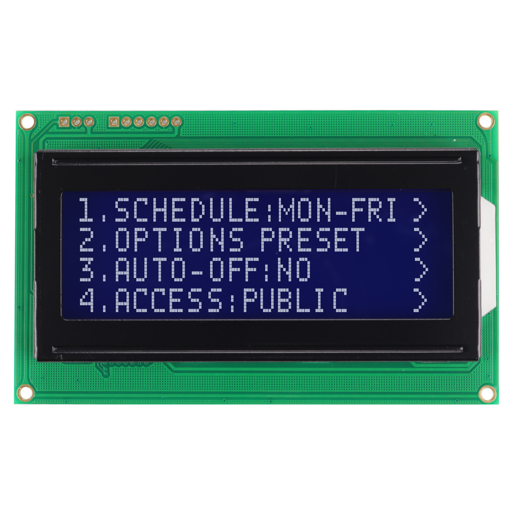
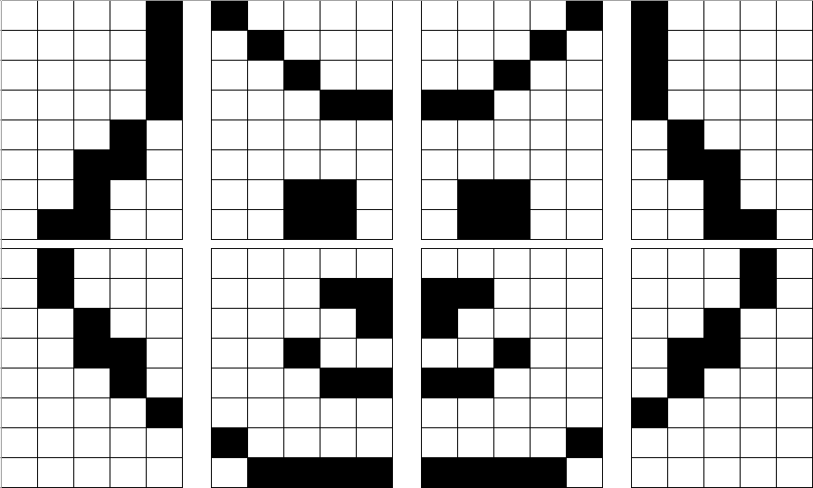

# Entrega 1 del proyecto WP01
## Introduccion

En el ámbito de la electrónica digital, la integración de sensores y pantallas a través de Field-Programmable Gate Arrays (FPGAs) ofrece un vasto potencial para desarrollar aplicaciones innovadoras y educativas. Este proyecto tiene como objetivo diseñar y construir un dispositivo Tamagotchi utilizando una FPGA como plataforma principal de desarrollo.

El Tamagotchi es un icónico juguete virtual que simula el cuidado de una mascota digital. Su popularidad en los años 90 despertó el interés en la interacción entre dispositivos electrónicos y usuarios, ofreciendo una experiencia lúdica y educativa. En este proyecto, se busca replicar esta experiencia utilizando tecnología moderna y componentes electrónicos avanzados.

### Objetivo

 * Diseño e Implementación en FPGA: Utilizar una FPGA para diseñar e implementar la lógica del Tamagotchi. La FPGA permitirá la flexibilidad y personalización necesaria para gestionar la interacción entre los diversos componentes.

 * Integración de Sensores: Incorporar diversos sensores (por ejemplo, temperatura, luz, ultrasonido) para simular las condiciones ambientales y las necesidades del Tamagotchi. Estos sensores permitirán crear una experiencia de usuario más realista y dinámica.

 * Interfaz de Usuario mediante Pantalla: Utilizar una pantalla gráfica para mostrar el estado del Tamagotchi, sus necesidades y sus acciones. La pantalla servirá como medio de comunicación entre el usuario y la mascota digital.

 * Programación y Simulación: Desarrollar y probar el código VHDL/Verilog necesario para que la FPGA gestione las interacciones entre los sensores y la pantalla. Realizar simulaciones para asegurar el correcto funcionamiento antes de la implementación física.

## Descripcion General del Sistema

El desarrollo de un Tamagotchi utilizando una FPGA no solo es un ejercicio técnico avanzado, sino también una oportunidad para aplicar conocimientos teóricos en un contexto práctico y lúdico. La combinación de sensores y pantallas a través de una FPGA ilustra cómo estos componentes pueden integrarse para crear sistemas electrónicos complejos y funcionales. 

El alcance de este proyecto incluye el diseño, implementación y prueba de un prototipo funcional de Tamagotchi en una FPGA. Las limitaciones pueden incluir restricciones en los recursos de hardware disponibles, como la cantidad de puertas lógicas en la FPGA, la resolución de la pantalla y la precisión de los sensores utilizados.

Tendra como entradas 4 sensores que indicaran la temperatura, humedad, luz y el sensor de ultrasonido, ademas de botones e interruptores, todo para crear estimulos y ambientes necesarios para que se realizen cambios en el tamagotchi.

## Descripción del Sistema
### Sistema de Botones
El tamagochi tendra cuatro botones o interruptores con las siguientes funcionalidades:

+ **Boton Alimentacion:** Este es un ***pulsador*** y servira para dar alimento a la mascota virtual.
+ **Interruptor de modo:** Este es un ***interruptor***, permitira entrar al modo juego y tener otras interacciones con la mascota.
+ **Boton Reset:** Este es un ***pulsador***, restablece estadisticas y datos del juego.
+ **Boton Test:** Este es un ***interruptor***, servira para cambiar los estados de la mascota y poder observar todas las funciones.

### Sistema de Sensado
Se usaron 4 sensores, estos sirven para dar estimulos a la mascota virtual y/o mejorar la interacion jugador-maquina. Estos sensores y sus interacciones son:

+ **Sensor Ultrasonido(hc-sr04):** Este sensor detecta proximidad de objetos por medio del eco producido por una onda enviada por el sensor al rebotar con un objeto. Se usa para el modo juego, aumenta la amistad al dejar activado por cierto tiempo el sensor.

+ **Sensor de Temperatura(ds18b20):** Este sensor permite por medio de una señal de 8 bits conocer la temperatura, tiene un rango de operacion de -55 a 125 grados centigrados. Se definio un limite de temperatura para el frio, este afectara la amistad mientras la mascota descansa.

+ **Sensor de Luz(Modulo LDR SENL):** Este modulo tiene una fotoresistencia y es capaz de entregar una salida digital de un bit para iluminacion, en este proyecto se usara como interruptor interviniendo en los ciclos de descanso de la mascota virtual.

+ **Sensor de Humedad(Modulo HD-38):** Funciona al igual que el sensor de ilumincaion, este se usara para la interaccion del baño de la mascota. 

### Sistema de Visualizacion
#### Display LCD 20x4
Es un dispositivo de visualización que permite mostrar hasta 20 caracteres por línea en un total de 4 filas, ofreciendo una capacidad de 80 caracteres en total. Es muy utilizada en proyectos de electrónica y microcontroladores como Arduino y Raspberry Pi. Está basada en el controlador HD44780 y se puede controlar a través de una interfaz paralela (4 o 8 bits) o mediante I2C, si se usa un módulo adaptador. Su retroiluminación LED, generalmente azul con texto blanco, asegura una excelente visibilidad. Es ideal para mostrar información básica como menús, datos de sensores o mensajes de estado en proyectos interactivos.

## Arquitectura del sistema 
### Diagrama de caja negra

<!--### Máquina de Estados General

 -->

### Descripcion de Componenetes
+ **FPGA CYCLONE IV EP4CE10E22C8:** Producida por Intel y lanzada en el 2009, cuenta con 22000 elementos logicos y albegara toda la logica de comportamiento de la mascota virtual.

+ **DISPLAY LCD 20x4:** La pantalla LCD 20x4 es un dispositivo electrónico diseñado para mostrar texto en cuatro líneas, con un máximo de 20 caracteres por fila. Es popular en aplicaciones donde se requiere mostrar información en tiempo real, como en sistemas embebidos y proyectos de automatización. Su controlador HD44780 facilita la integración con microcontroladores, y puede comunicarse mediante una interfaz paralela o a través de I2C, con el uso de un adaptador.

+ **Interruptores:** Se usaran dos interruptores, estos envia una señal de 1 bit segun este activado o no, serviran para entrar al modo juego o el modo test.
+ **Pulsadores:** Se usaran 3 pulsadores, uno para dar alimento a la mascota con cada pulso como un nivel de alimentacion, otro para el reset que al oprimirlo se restablece las estadisticas y datos de juego y otro para el modo test que cambia el estado cuando se oprime.
+ **Sensor Ultrasonido(hc-sr04):** El sensor emite ondas ultrasónicas a través de un transductor y mide el tiempo que tardan las ondas en rebotar de vuelta después de chocar contra un objeto. Con esta medida de tiempo y la velocidad del sonido, puede calcular la distancia entre el sensor y el objeto. El HC-SR04 tiene dos partes principales: el emisor, que envía las ondas ultrasónicas, y el receptor, que las recibe cuando se reflejan y tiene cuatro pines: Vcc (alimentación), Trig (activación), Echo (recibo), y GND (tierra). Puede medir distancias desde 2 cm hasta aproximadamente 400 cm (4 metros). La comunicacion con la FPGA es PWM.

 + **Sensor de Temperatura y Humedad(DHT11):** El DHT11 es un sensor básico, de bajo costo y popular que se utiliza para medir la temperatura y la humedad del entorno. Es ampliamente utilizado en proyectos de electrónica y sistemas embebidos debido a su simplicidad y facilidad de uso. Puede medir temperaturas en un rango de 0 a 50 grados Celsius, con una precisión de ±2 grados Celsius y puede medir la humedad relativa en un rango de 20% a 90%, con una precisión de ±5%.

+ **Sensor de Luz(Modulo GLS516):** Es un sensor fotoeléctrico que utiliza una célula fotosensible para detectar la intensidad de la luz. Convierte la luz ambiental en una señal eléctrica, permitiendo así medir la intensidad luminosa.

 + **Sensor de Humedad(Modulo GLS516):** El GLS516 es un módulo sensor de humedad utilizado para medir la humedad del suelo. Este tipo de sensor es especialmente útil en aplicaciones de agricultura y jardinería, donde es crucial monitorear y controlar el nivel de humedad del suelo para asegurar el crecimiento saludable de las plantas. Este módulo puede proporcionar tanto una salida analógica como una salida digital. La salida analógica da un valor de voltaje proporcional al nivel de humedad, mientras que la salida digital puede ser configurada para indicar un umbral específico de humedad.

### Interfaces
+ **SPI(Serial Peripheral Interface):** es un protocolo de comunicación en serie comúnmente utilizado para conectar dispositivos electrónicos y periféricos a microcontroladores y microprocesadores. El SPI sigue un modelo maestro-esclavo, donde un dispositivo actúa como maestro y uno o más dispositivos como esclavos. El maestro controla la comunicación, mientras que los esclavos responden a las órdenes del maestro, este puede comunicarse con múltiples esclavos, seleccionando a cada uno mediante una señal de selección de esclavo (Slave Select, SS), también conocida como Chip Select (CS). Tiene las siguientes lineas de Comunicacion:
  
  + SCLK (Serial Clock): Es la línea de reloj. El maestro genera la señal de reloj, que sincroniza la transferencia de datos.
  + MOSI (Master Out, Slave In): Es la línea por donde el maestro envía datos al esclavo.
  + MISO (Master In, Slave Out): Es la línea por donde el esclavo devuelve datos al maestro.
  + SS (Slave Select): Es la línea utilizada para seleccionar al esclavo con el que el maestro desea comunicarse.
  
+ **I2C (Inter-Integrated Circuit):** es un protocolo de comunicación en serie que permite la conexión de múltiples dispositivos electrónicos usando solo dos líneas: SDA (Serial Data) y SCL (Serial Clock). Fue desarrollado por Philips en los años 80 y es muy utilizado en sistemas embebidos para la comunicación entre microcontroladores, sensores, pantallas LCD, entre otros dispositivos. Tiene las siguientes caracteristicas:

  + Multimaestro y multiesclavo: Un único bus puede tener varios dispositivos maestros (que inician la comunicación) y varios esclavos (que responden a las solicitudes).
  + Dos líneas: Solo requiere dos cables para la comunicación: uno para los datos (SDA) y otro para la sincronización (SCL).
  + Direcciones únicas: Cada dispositivo en el bus tiene una dirección única, lo que permite que el maestro se comunique con dispositivos específicos.
  + Velocidad de comunicación: Los dispositivos I2C pueden operar en diferentes velocidades, siendo las más comunes 100 kHz (estándar) y 400 kHz (rápida).

  *Se usara para el DISPLAY LCD 20x4*

+ **PWM (Pulse Width Modulation, o Modulación por Ancho de Pulso):** es una técnica utilizada en electrónica para controlar la cantidad de energía entregada a un dispositivo a través de señales digitales. Se usa para variar la potencia entregada a dispositivos como motores, luces, y otras cargas, sin tener que usar una señal analógica.

  *Se usara para el sensor de ultrasonido*

+ **1-WIRE:** es un protocolo de comunicación bidireccional que utiliza solo una línea para datos y alimentación, además de un segundo hilo para tierra. Esto permite reducir la cantidad de cables necesarios para conectar dispositivos. El protocolo está basado en un modelo maestro-esclavo, donde un dispositivo actúa como maestro y puede controlar varios esclavos. El maestro inicia la comunicación y controla el flujo de datos. Los esclavos responden a las instrucciones del maestro. Cada dispositivo 1-Wire tiene una dirección única de 64 bits, lo que permite identificarlo y distinguirlo de otros dispositivos en la misma línea. Esto es útil para aplicaciones con múltiples dispositivos en un solo bus. La comunicación se realiza a través de secuencias de bits, donde un pulso corto o largo define un bit de datos. Esto se logra mediante cambios en la tensión de la línea de datos.

## Especificaciones de Diseño Detalladas
### Funcionamiento del sensor de distancia ultrasónico HC-SR04

Todo comienza cuando el pin del disparador se establece en ALTO durante 10 µs. En respuesta, el sensor transmite una ráfaga ultrasónica de ocho pulsos a 40 kHz. Este patrón de 8 pulsos está especialmente diseñado para que el receptor pueda distinguir los pulsos transmitidos del ruido ultrasónico ambiental.

Estos ocho pulsos ultrasónicos viajan por el aire alejándose del transmisor. Mientras tanto, el pin de eco pasa a ALTO para iniciar la señal de eco.

Si esos pulsos no se reflejan, la señal de eco se agota y baja después de 38 ms (38 milisegundos). Por lo tanto, un pulso de 38 ms indica que no hay obstrucción dentro del rango del sensor.

### Modos de Operacion

Los modos de operación se trata de un conjunto de instrucciones que puede ejecutar una aplicación. El conjunto de instrucciones que se pueden ejecutar según el que modo escoja el usuario por, lo mismo es el modo o meoto de operacción utilizado ya que representa una diferencia entre cada uno de los metodos posibles.

+ **Modo Test:** permite a los usuarios y desarrolladores validar la funcionalidad del sistema y sus estados sin necesidad de seguir el flujo de operación normal. En este modo, se pueden forzar transiciones de estado específicas mediante interacciones simplificadas, como pulsaciones cortas de botones, para verificar las respuestas del sistema y la visualización. Este modo es esencial durante la fase de desarrollo para pruebas rápidas y efectivas de nuevas características o para diagnóstico de problemas.

  + **Activacion:** Se ingresa al modo Test con un interruptor.
  + **Funcionalidad:** Permite la navegación manual entre los estados del Tamagotchi, ignorando los temporizadores o eventos aleatorios, para observar directamente las respuestas y animaciones asociadas.

+ **Modo Normal:** El Modo Normal es el estado de operación estándar del Tamagotchi, donde la interacción y respuesta a las necesidades de la mascota virtual dependen enteramente de las acciones del usuario.

  + **Activacion:** La mascota virtual por defecto va a estar en este modo, o si esta en modo test para volver a este hay que desactivar el interruptor de test.

  + **Funcionalidad:** La mascota va a responder a multiples estimulos provenientes de los botones, y los sensores, estos estimulos ademas del paso del tiempo haran que cambie de estados siendo estos feliz, neutro, hambriento, descanso, enfermo y un estado extremo que es muerto, ademas del modo test.

### Estados y Transiciones:
#### Estados
La mascota virtual tiene diferentes estados dependiendo de sus estimulos o el tiempo puede estar en cada uno de ellos, para ellos primero se debe definir el tiempo de la mascota virtual que para eventos actuales se tomara como *X* como 1 dia de 24 horas, y los estados principales iran en una barra de niveles de 0 a 5.

##### Estados Principales:

+ **Hambre:** Se definira segun el tiempo o las veces que se alimente a la mascota virtual, si la estadistica de hambre baja entrara a este estado.

  + Tiempo para que la barra de hambre baje 50% es un sexto del tiempo *X*. $t=\frac{X}{6}$
  + Alimentar la mascota virtual aumenta un nivel en su barra de estado, significa un pulso del boton de alimentar.

+ **Descanso:** Se debe cumplir la duracion interna de un dia o *X* para que la barra de sueño llegue a 0. Debe tener un tiempo de descanso de $t=\frac{X}{3}$ para llenar la barra totalmente. El sueño se controlara mediante el sensor de iluminacion funcionando como interruptor.

+ **Nivel de Amistad:** Este estado comprende el animo de la mascota virtual. Esta barra aumenta entrando al modo juego e interractuando con la mascota virtual. 

Si cualquiera de estas estadisticas llega al nivel minimo la mascota entrara al estado muerto.

### Transiciones:
+ **Tiempo:** Se manejara una escala de *X* tiempo para 1 dia de la mascota virtual y con respecto a ello se hace el calculo de las demas interracciones de tiempo.
  
  + Para que la barra de alimentacion baje 4 puntos se necesita $\frac{X}{6}$ tiempo.
  + Para que la barra de sueño pase de 8 a 1 se necesita $\frac{X}{3}$ tiempo.
  + Si está durmiendo, se suma descanso, y no se resta salud ni hambre.

+ **Interacciones:** Se pueden presentar diferentes interacciones del usuario o el ambiente con la mascota por medio de los sensores o los botones.

  + **Sensor Ultrasonido:** Presenta interraciones al acercarse, acariciar o jugar con la mascota virtual mientras se esta en el modo juego.
  + **Sensor de Luz:** Sirve como interruptor, al detectar o no iluminacion. Si no detecta luz la mascota entrara en estado de sueño, si no estara en despierto permanentemente.
  + **Sensor de Temperatura:** Si detecta una temperatura debajo del limite se vera afectada negativamente la barra de amistad.
  + **Pulsador de Alimentacion:** Cada vez que se pulse aumentara en 1 la barra de alimentacion de la mascota virtual, hasta un maximo de 5.
  + **Sensor de Humedad:** Se tomara la interaccion de bañarse cuando el sensor se introduzca en agua, esto solo se podra en modo juego.

### Interfaz de usuario:
+ **Feliz:**

+ **Neutro:** 

      
+ **Hambriento:**

+ **Descanso:**

+ **Muerto:**

+ **Amistad:**

